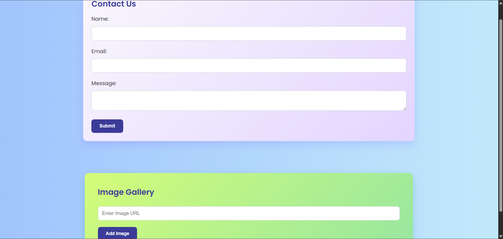
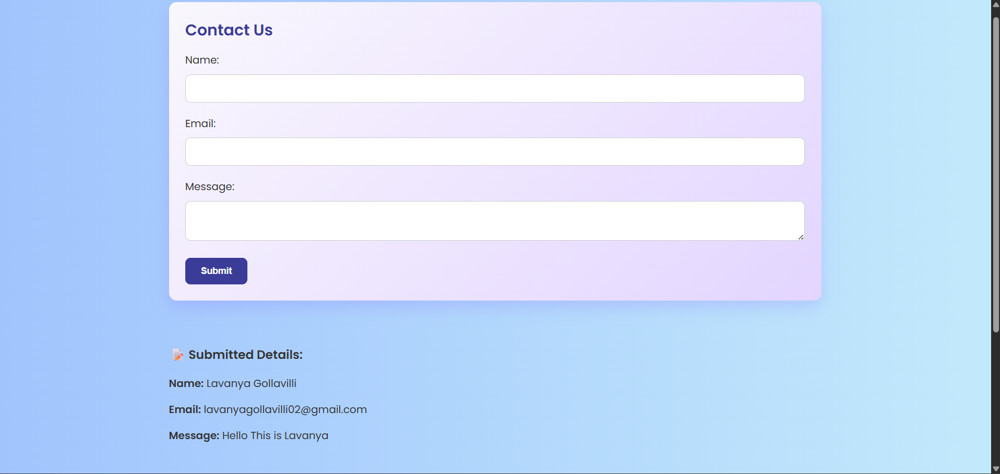
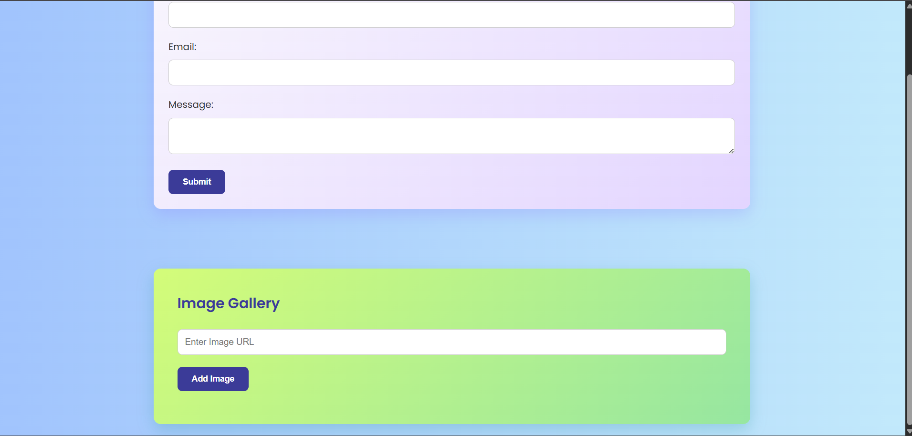
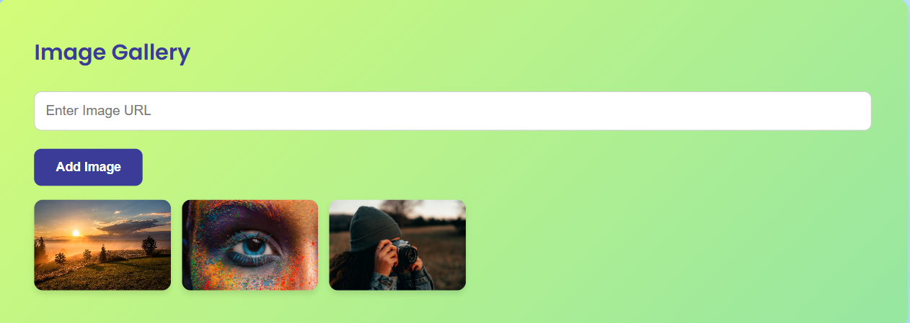

# 🌐 Apex Planet Internship - Task 2

This project is part of the **Apex Planet Internship Program**, focused on applying **intermediate HTML, CSS, and JavaScript** skills to build a responsive and interactive webpage.

## 📌 Project Title
**Contact Form & Image Gallery Webpage**

## 📁 Description
A colorful, responsive web page featuring:
- A contact form with validation
- An image gallery with dynamic image addition
- Responsive layout using CSS Grid
- JavaScript DOM manipulation and event handling

## 🚀 Features
- 🎨 Colorful, modern UI design
- ✅ Client-side form validation with success display
- 🖼️ Users can upload and view images in the gallery
- 📱 Fully responsive design (mobile-friendly)

## 🔧 Technologies Used
- HTML5
- CSS3
- JavaScript (Vanilla JS)
- Git & GitHub

## 🖼️ Live Demo
[Click to View Live Project](https://your-username.github.io/apex-task-2/)

## 💻 Screenshots

